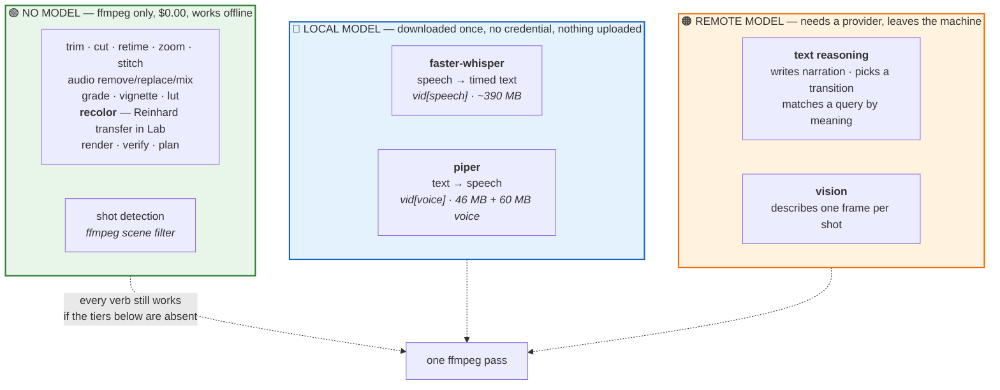
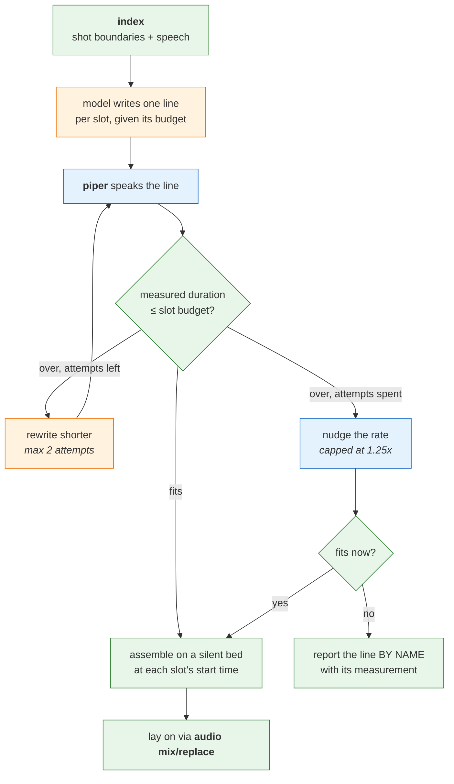

# Architecture

Mechanics. For *why this exists*, read `VISION.md`.

## The one decision everything follows from

**The pipe carries a plan, not pixels.**

```bash
vid trim talk.mp4 --from 0:10 --to 2:30 \
  | vid retime --ramp "1x@0 0.25x@1:05 1x@1:12" \
  | vid zoom --to 1.4 --at 0:45 \
  | vid stitch intro.mp4 - outro.mp4 --transition dissolve:0.8 \
  | vid render out.mp4
```

Every verb reads a plan on stdin, appends one operation, and writes the plan to stdout.
Nothing decodes a frame until `render`, which compiles the whole plan into **one**
`filter_complex` and encodes **once**.

Why this and not the obvious thing:

- The obvious thing — each verb shells out to ffmpeg and writes a temp file — costs N
  decodes and N encodes for N operations, and loses quality at every step. Measured
  elsewhere at 2–10× slower than a single graph for the same work.
- Every serious tool converges here. auto-editor, ffmpeg-python, MoviePy and LosslessCut
  all accumulate operations and compile one graph.
- It falls out of a constraint we cannot avoid anyway: `atempo` takes a scalar, so a
  non-linear speed ramp **must** be decomposed into constant-speed regions before it can
  be expressed. Once the tool holds the shape of the edit to do that, holding it for
  everything else is free.

Consequences worth stating plainly:

- **Every verb except `render` is instant, deterministic, and needs no ffmpeg and no
  provider.** A plan is JSON. The spec's "deterministic paths run with no AI configured"
  is not something we work around; it is the default state of the tool.
- **The plan is the artifact.** It can be saved, diffed, reviewed, hand-edited, and
  replayed. An edit produced by a model is as inspectable as one typed by a person.
- **`render` can explain itself.** `--print-command` emits the ffmpeg invocation. A tool
  you cannot see through is a tool you cannot debug.

## Layer one: the mechanical verbs

Deterministic. No model. No credentials.

| verb | what it does | the expertise it holds |
|---|---|---|
| `trim` | keep a time range | keyframe alignment; when a cut is free and when it costs a GOP re-encode |
| `cut` | remove a time range | the same, inverted |
| `retime` | constant speed, or a ramp | `setpts` for video, `atempo` for audio — and that `atempo` is scalar-only, so a ramp is segmented into constant regions and rejoined |
| `zoom` | Ken Burns / animated zoom | `zoompan` quantises the crop to whole source pixels, so a slow zoom stutters; upscale first |
| `stitch` | concatenate | concat demuxer (lossless, identical params) vs concat filter (re-encodes); which applies |
| `transition` | between two clips | `xfade` is video-only and always re-encodes; audio needs `acrossfade`; offsets are cumulative |
| `caption` | burn in subtitles | the `subtitles` filter over an SRT the speech index already produces |
| `render` | compile and encode | the whole graph, once |
| `plan` | show / validate | — |

**Lossless where possible, honestly.** `trim` and `stitch` can be stream copies when the
cut lands on a keyframe and the inputs agree. When they cannot, the tool says so rather
than silently re-encoding: a caller who asked for a fast cut deserves to know it was not
one.

## Layer two: the index

Answering *"where does she explain pricing?"* requires a time-indexed account of the
video's content. That index is the expensive artifact, and it is built once and reused.

```
vid index <video>
  shots     ffmpeg scene detection            deterministic, free, no provider
  speech    transcript, WORD-level timing     local (whisper.cpp) or API
  vision    one description per shot          vision provider, only when asked
```

Three things make this shape right:

- **Shot detection is free and deterministic.** It needs no model at all, and it reduces
  the visual problem from 18,000 frames to ~40 — one per shot. Describing 40 frames costs
  cents; describing 600 does not.
- **Segment-level timing is enough, and claiming otherwise was wrong.** An earlier draft
  of this document called word-level timestamps "table stakes". Checking the backends
  refuted it twice over. First, almost nothing produces true word-level timing: whisper.cpp
  and faster-whisper both emit segment boundaries, and only whisperX does real per-word
  alignment, at roughly 600 MB of extra dependencies and a slower pass. Second, and more
  decisively, **the precision chain has a weaker link than the transcript.** A lossless cut
  lands on a keyframe, and a GOP is commonly two seconds — so sub-second word precision is
  discarded by the very next constraint. Segments are typically 2–10 seconds, which is the
  right granularity for *finding a region*, which is the actual use case.

  Word-level remains a real upgrade for karaoke-style captions and for
  cut-exactly-at-the-sentence on a re-encode. It is an opt-in backend, not a floor.
- **The index is durable and shared.** Like a research run directory, it accumulates.
  Ten questions about one video cost one transcription.

## Layer three: the smart verbs, and the guard that makes them trustworthy

```bash
vid find "where she explains pricing" talk.mp4 | vid trim | vid render out.mp4
```

`find` returns time ranges **grounded in the index**, with the evidence that produced them.

**A model is never asked for a timestamp.** This is not a stylistic preference. LLMs
fabricate timecodes — plausible, confident and wrong — and a fabricated timestamp is
indistinguishable from a correct one until you watch the output. So:

1. The index produces chunks, each already carrying a real time range from the transcriber.
2. The model is shown the chunks and asked **which ones**, by id.
3. The timestamp comes from the index, by lookup.

The model's judgment is used for the thing it is good at — *"is this passage about
pricing?"* — and is structurally prevented from touching the thing it is bad at. A
returned chunk id that does not exist is a loud error, not a plausible wrong answer.

That guard is testable, and it is the first thing that should have a test.

## The three tiers, and the one invariant that keeps a model out of the render path

`VISION.md` states the line: a model may CHOOSE from what exists, never INVENT. Here is
what that looks like in code, using `--transition` as the worked example because it is the
one place all three tiers are visible at once.

| tier | the caller writes | what happens | guard |
|---|---|---|---|
| **1** | `--transition dissolve` | matched against the 58 presets | none needed; nothing was decided |
| **2** | `--transition "soft and dreamy"` | a model picks one of the 58 | **closed set** — an answer off the list is a loud error |
| **3** | `--transition "slam in and overshoot"` | a model would WRITE an xfade expression | none yet — parked until `verify` exists |

**Tier 2 is safe for exactly one reason, and it is worth saying plainly: the set is
closed.** The model returns `dissolve` or it returns something that is not a transition,
and the second case is caught by a membership test. Tier 3 has no such test — an invented
expression that compiles and moves wrongly is indistinguishable from a correct one until a
human watches it. That is the whole reason tier 3 waits on property-based verification
rather than shipping now.

A near-miss is corrected, not guessed. `--transition disolve` is one word, so it reads as a
name; the tool suggests `dissolve` rather than handing a typo to a model that would
cheerfully interpret it as a description and charge for the privilege.

### The invariant: a model runs at PLAN time, never at RENDER time

When a description is resolved, the model runs **once**, while the plan is being built, and
the plan records both what was asked and what was chosen:

```json
{ "op": "stitch",
  "transition": "dissolve",
  "transition_requested": "soft and dreamy",
  "transition_rationale": "grainier and softer than a plain crossfade" }
```

Three properties follow, and they are promises rather than accidents:

- **A plan renders identically on a machine with no credentials at all.** Everything a
  model contributed is already resolved into the plan; `render` reads values, not intent.
- **Re-rendering never re-invokes a model.** No cost drift between runs, no nondeterminism,
  no surprise when a plan from last week renders differently today.
- **The choice is reviewable before a frame moves.** `vid plan` shows what was asked, what
  was chosen, and why. Disagreeing is an edit to a JSON file, not an argument with a tool.

This is what makes the earlier claim about auditability real rather than rhetorical. An
edit a model proposed is as inspectable as one a person typed, because by the time it
reaches the renderer it *is* one.

## Where the intelligence actually runs

"Smart tool" suggests one kind of smartness. This one has **four**, and two of them never
leave the machine. A caller deciding what to install — or whether they can use this at all
on a locked-down box — needs the boundary drawn rather than described.



**The green box is the whole tool minus four verbs.** Eighteen of twenty-one capabilities
need no model of any kind, and `recolor` is the one worth pointing at: matching a video's
palette to a reference photograph *sounds* like it ought to need a model, and it is
arithmetic end to end. Keeping capabilities in the green box is what leaves the smart tiers
for work that genuinely needs judgment.

**The blue box costs disk, not credentials.** Transcription and speech synthesis both run
locally — a caller on an air-gapped machine can index, search by what was said, and speak a
narration they wrote themselves. Verified in a clean container: both engines install with
`uv`, need no compiler, and coexist without fighting over `onnxruntime`.

**Only the orange box leaves the machine**, and every verb that touches it says so before it
spends anything. `vid check` reports which of the three zones this installation actually has.

---

## Voice-over: the narration pipeline

`vid narrate <video> "<prompt>"` is the one capability that uses **all three zones in a
single command**, and the way it moves between them is the design.

### Why it cannot just write a script and read it

Generate a narration, speak it, lay it on — that fails, and it fails at the **end**, after
everything expensive has run. Thirty seconds of video under forty-five seconds of speech is
simply broken, and you find out last.

So the video's own **shot boundaries become slots**, each with a duration. The model writes
one line per slot, told that slot's budget. Every line is spoken and **measured**. A line
that overruns is sent back to be shortened — twice at most — then allowed a modest
speed-up, and if it still does not fit it is **reported by name** rather than quietly
overrunning.

### The loop alternates zones on purpose



**Every decision in that loop is green.** The model writes and rewrites; it is never asked
whether its own output fits. "Does this fit?" is a number — 4.25s against a 3.00s slot — and
the arithmetic that answers it needs no provider and cannot be talked round.

This is the transition gate in a different domain. Where a cheap deterministic check exists
on a model's output, generation is defensible; where it does not, it is a coin flip with
good manners.

### What the loop guarantees

- **It degrades per segment.** Three lines where the middle one cannot fit produce
  `[fitted, OVER, fitted]` — one line named with its overrun, and the rest still usable.
  This is the entire reason for fitting per slot rather than globally.
- **The script is inspectable before anything is synthesised.** `--script-only` prints it as
  JSON and spends nothing. Narration is the most expensive thing here to get wrong.
- **Silence between lines, never stretched speech.** A slowed voice filling a gap is
  instantly recognisable and worse than a pause.
- **Slots under two seconds are left silent.** A one-second shot cannot hold a sentence, and
  cramming one in produces the rushed voiceover everybody recognises.
- **It lays the result on through the existing audio verbs** — `mix` when the source already
  has speech, `replace` when it is silent — rather than a parallel path. One way to put
  sound on a video, not two.

### What each half needs, and what happens without it

| half | zone | without it |
|---|---|---|
| writing the narration | 🟠 remote text model | `narrate` refuses, naming what to configure |
| speaking it | 🔵 local `vid[voice]` | `narrate` refuses, naming the install command |
| timing, assembly, laying it on | 🟢 ffmpeg | these are the parts that always work |

**Both halves are required and they are independent**, which is the thing that catches
people: an agent driving this tool once reached "not configured" partway through, had to
work out which of two separate things was missing, and substituted the operating system's
own speech synthesiser instead. `vid check` reports both, and the skill file now states the
pairing up front.

---

## Finding a moment on screen: embed to filter, caption to finalise

The visual half of `find` and `highlight` needs to answer "when is X on screen?". Embeddings
look like the obvious answer, and they are half of it.

**Why embeddings are structurally right.** An embedding maps a segment to a vector. The
timestamp comes from *which segment we chose to embed* — our own bookkeeping — so the model
is never in a position to emit a timecode at all. The guard is not enforced by discipline
here; it is unreachable by construction. That is the strongest form of the rule in this
document.

**Why embeddings are not sufficient, which measurement decided.** CLIP-class encoders are
spatially coarse. ViT-B/32 at 224px is 7×7 pixels per patch, so a small on-screen
element — an error dialog, a button, a price — occupies almost nothing the model can see.
Fine-grained retrieval recall drops to roughly 40–60% (arXiv 2404.03539), against 85–95%
for describing the frame and searching the description. Cloud embeddings raise the baseline
but do not fix the specificity problem.

So embedding alone loses precisely the queries this tool exists for. "Outdoor, daytime" it
handles; "the moment the error appears" it does not.

**The shape that works is two stages:**

```
shots        deterministic, free            40 candidates from 18,000 frames
embed        cheap, fast, coarse            40 → the 5 worth looking at
describe     vision model, 5 frames only    which of the 5, and why
```

Each stage is a filter for the next, so the expensive one runs on single digits. And the
guard survives the whole pipeline: a description is *text about a shot*, the shot id carries
the time, and the timestamp is a lookup at every stage.

**Backends follow the same tiering as speech.** Local CLIP via a GGML-style runtime is
~400 MB and needs no torch; Gemini's multimodal embedding needs no install and shares one
space with text queries, at roughly a tenth of a cent to index a ten-minute video. Neither
is a default we should pick on a caller's behalf — `check` reports which is available.

## What is parked, and why it is written down

**Remotion** — a React frame-synthesis engine — was assessed as a rendering backend for
the visually authored parts: captions, shapes, annotations, richer transitions. It is
genuinely strong at those. It is parked, for reasons that are worth keeping:

- It has **no expression for passing bytes through**. Its only `-c:v copy` refers to its
  own pre-encoded chunks, never to source video. Every output frame is synthesised
  through a headless-browser screenshot and re-encoded. Most of this tool's verbs are
  exactly the operations it cannot do.
- Its licence requires payment above three employees and restricts derivative works —
  an obligation a published tool would pass to every user.
- Its captions package is data-only (parse/serialise SRT); there is no renderer. Its
  speed-ramp recipe is O(n²). There is no Ken Burns package.

None of that makes it a bad library; it makes it the wrong *core* dependency for a tool
whose main job is not touching pixels. If it returns, it returns as an optional adapter
over short segments, behind the same plan.

## Backends, and the install cost of each

**Local inference is the default.** Transcription is the one capability here that has a
genuinely good offline story, and a caller should not have to send a video's audio to a
third party to find out when someone said "pricing".

But local inference is not free — it is paid in install complexity instead of dollars, and
that cost lands on whoever has to set the tool up. Increasingly that is an agent, running
unattended, which cannot answer a prompt or debug a compiler error.

**The tiers are `uv` extras, not a list of things to go and install.** This tool is
installed with `uv tool install`, which gives it an isolated environment — so there is no
`pip install` a caller can usefully run afterwards, and telling them to would be wrong.
An optional backend is declared as an extra and comes in through the same command that
installs the tool:

| tier | install | unlocks | real cost |
|---|---|---|---|
| **0** | `uv tool install 'git+…'` | every mechanical verb | ffmpeg, one system package |
| **1** | `uv tool install 'vid[speech] @ git+…'` | `index speech`, `find` | no compiler, no platform branch; model auto-fetched and cached (~140 MB for `base.en`) |
| **1′** | tier 0 + whisper.cpp on PATH | same, faster on Apple Silicon | `brew install whisper-cpp` on macOS; on Linux there is **no apt package** and it is a cmake build |
| **2** | tier 0 + an API key | cloud transcription | no install at all, but money and a network round trip |
| **3** | `uv tool install 'vid[speech-words] @ git+…'` | true per-word timing | ~600 MB and a slower pass |

Adding a tier later is `uv tool install --force` with the extra, or `uv tool upgrade
--with`. Both are one command, which is the bar: **a tier a caller cannot reach in one
command is a tier they will not reach.**

**Default: faster-whisper**, as the `speech` extra. Not because it is the best transcriber
— whisper.cpp with Metal is faster on a Mac — but because it is the only one an agent can
install unattended and expect to succeed: it arrives with the tool itself, needs no
compiler, no platform branch, no separate step, and its model download is idempotent and
works CPU-only in a container.

Note what this makes possible: **tier 1′ and tier 2 are not extras at all.** whisper.cpp
is a binary on PATH and an API key is an environment variable, so neither is a Python
dependency and neither can be expressed as one. That asymmetry is the finding — see the
open question below.

Two traps worth recording, since both would be discovered the hard way:

- whisper.cpp's binary was **renamed from `main` to `whisper-cli`**. Anything shelling out
  to it must not assume the old name.
- A prebuilt whisper.cpp binary can die with SIGILL on a machine lacking the build host's
  CPU features. Building portable requires `-DGGML_NATIVE=OFF`.

**Gemini is for embeddings, not for timecodes.** Its embedding models are cheap and good,
and semantic search over transcript chunks is exactly the job. Asking it — or any model —
to *return a timestamp* runs straight into the failure this design exists to prevent.

## Setup is a first-class feature, not a README section

This is the first tool here where getting to a working state is genuinely hard, and it has
to be treated as part of the product:

- **`check` reports the tier you are actually in** — which backends are present, which are
  missing, and what each would unlock. Deterministic, free, no credentials.
- **Every refusal names the remedy.** A verb that needs a backend you do not have fails
  with the exact command that would fix it, not a stack trace.
- **The skill carries the ladder.** A harness installing this tool reads one document and
  can get from nothing to working without a human.

## Open questions

- **The manifest has no vocabulary for tiers or alternatives.** `requires[]` is a flat
  list, and this tool has four alternative paths to one capability, each with a different
  install cost, plus capabilities that are genuinely optional. Our research tools needed
  one backend and did not expose this. This is the clearest evidence we have that the
  spec's `requires[]` needs to express *alternatives* and *what each unlocks*.
- **And the alternatives are not even the same kind of thing.** One is a Python extra, one
  is a system binary on PATH, one is an environment variable. A manifest field that can
  only name packages describes one of the three. A caller asking "what do I need for
  `find` to work?" has three correct answers with different shapes, and today there is
  nowhere to put them.
- **Three distinct provider capabilities** — speech-to-text, vision, text reasoning —
  where our research tools needed one. "Which AI providers does this tool use?" has a
  compound answer here, and the manifest cannot currently give it.
